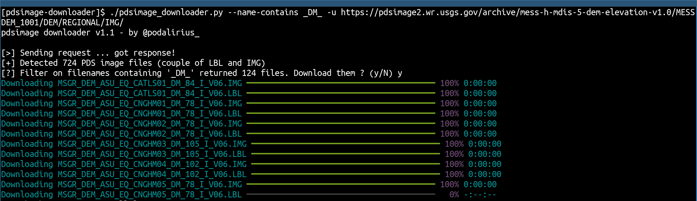

<p align="center">
  A python script to filter by filename and download PDS images.
  <br>
  
  <a href="https://twitter.com/intent/follow?screen_name=podalirius_" title="Follow"></a>
  <a href="https://www.youtube.com/c/Podalirius_?sub_confirmation=1" title="Subscribe"></a>
  <br>
</p>


## Features

 - [x] Running on windows and linux machines.
 - [x] Filter on specific filenames with `--name-contains` option.
 - [x] Choose the download directory with the `--output-dir` option.

## Installation

In order to use this script we need to install `bs4`, `lxml`, `requests` and `rich`. We can do this with this command: 

```
python3 -m pip install -r requirements.txt
```

or directly

```  
pip install bs4 lxml requests rich
```

## Usage

```
$ ./pdsimage_downloader.py  -h
pdsimage downloader v1.1 - by @podalirius_

usage: pdsimage_downloader.py [-h] -u URL [-n NAME_CONTAINS] [-D OUTPUT_DIR] [-v]

A python script to filter by filename and download PDS images.

optional arguments:
  -h, --help            show this help message and exit
  -u URL, --url URL     URL of the PDS image archive.
  -n NAME_CONTAINS, --name-contains NAME_CONTAINS
                        Filtering only files where the name contains this string.
  -D OUTPUT_DIR, --output-dir OUTPUT_DIR
                        Output directory where the images will be stored.
  -v, --verbose         Verbose mode. (default: False)
```

## Example

```
./pdsimage_downloader.py --name-contains _DM_ -u https://pdsimage2.wr.usgs.gov/archive/mess-h-mdis-5-dem-elevation-v1.0/MESSDEM_1001/DEM/REGIONAL/IMG/
```



## Demonstration

## On Windows:

https://user-images.githubusercontent.com/79218792/182469698-cce9bb6c-d57f-4588-9f16-eeb09215b775.mp4

## On Linux:

https://user-images.githubusercontent.com/79218792/182469687-fb5d2f3c-29f5-431f-bd0f-8beb55b10a56.mp4

## Contributing

Pull requests are welcome. Feel free to open an issue if you want to add other features.
